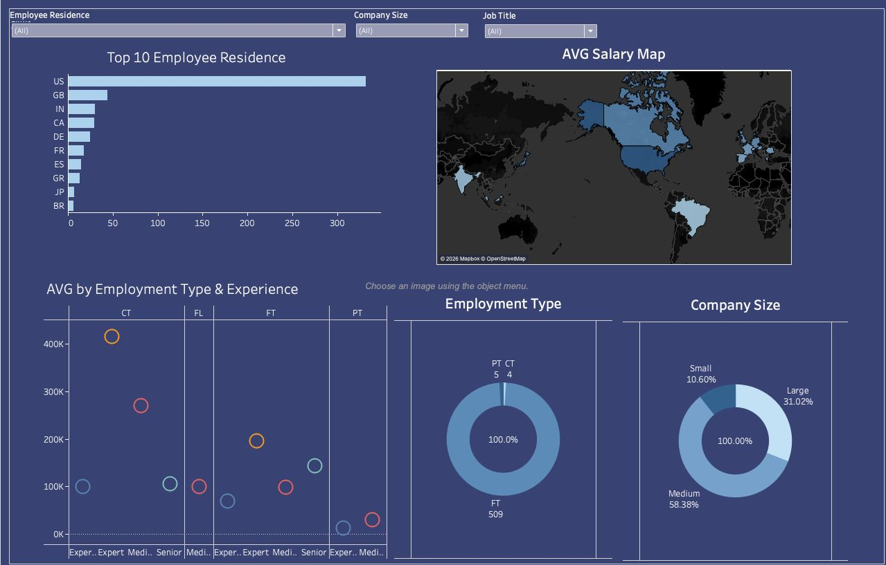

# Job Data Dashboard (Tableau)

## Project Overview
This Tableau dashboard analyzes job market data to identify salary trends, job roles, and industry insights.

## Key Insights
- Salary distribution by job role
- Highest paying industries
- Experience vs salary comparison
- Demand trends across different job categories

## Tools Used
- Tableau
- CSV Dataset
- Data Visualization Techniques

## 📷 Dashboard Preview

## Files Included
- Job Data Dashboard.twb
- ds_salaries.csv
- Dashboard screenshots (.png files)

## Author
Vinit Bhalerao